# comma-ai-calibration-challenge

Computer vision solution for the comma.ai Calibration Challenge using optical flow, focus-of-expansion geometry, temporal features, and robust regression to estimate vehicle pitch and yaw from dashcam video.

## About

This project is my solution to the comma.ai Calibration Challenge, which focuses on estimating the direction of vehicle travel in the camera frame from dashcam video.

The goal is to predict the pitch and yaw angle for every frame of a driving video.

I built a geometry-first computer vision pipeline that combines optical flow, focus-of-expansion estimation, temporal motion features, and regression-based calibration.

The solution was developed and evaluated using the five labeled challenge videos with leave-one-video-out validation to test how well the method generalizes across different driving sequences.

---

## Approach

The pipeline follows these steps:

1. Detect visual features in each frame.
2. Track features between consecutive frames using optical flow.
3. Filter unreliable and outlier motion tracks.
4. Estimate the focus of expansion from the observed motion.
5. Convert motion geometry into pitch- and yaw-related features.
6. Add temporal features to capture vehicle motion across multiple frames.
7. Train regression models using the labeled driving sequences.
8. Evaluate using leave-one-video-out validation.
9. Generate pitch and yaw predictions for the five unlabeled videos.

---

## Technologies

* Python
* OpenCV
* NumPy
* SciPy
* Scikit-learn
* Matplotlib

---

## Validation Results

The final model achieved an aggregate leave-one-video-out validation score of:

### **17.84% relative to the all-zero baseline**

| Video         |      Error |
| ------------- | ---------: |
| Video 0       |     12.07% |
| Video 1       |     24.98% |
| Video 2       |     10.31% |
| Video 3       |     36.36% |
| Video 4       |     10.02% |
| **Aggregate** | **17.84%** |

Lower scores indicate better performance.

> **Note:** This is a local cross-validation result on the provided labeled videos and should not be interpreted as an official comma.ai leaderboard score.

---

## Results

### Validation Performance

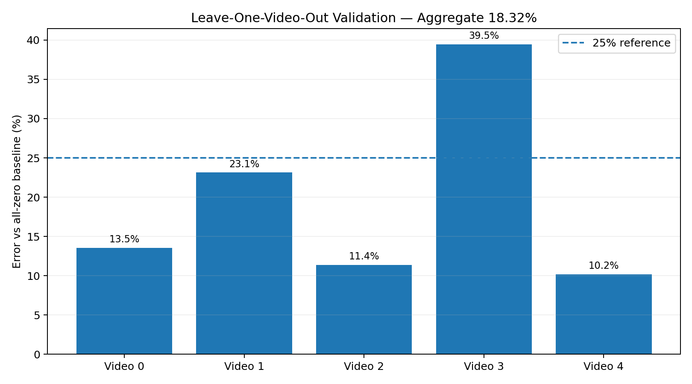

### Example Pitch Prediction

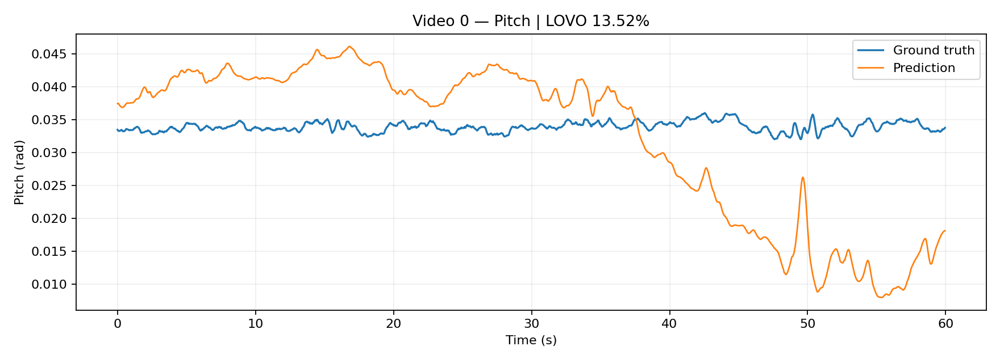

### Example Yaw Prediction

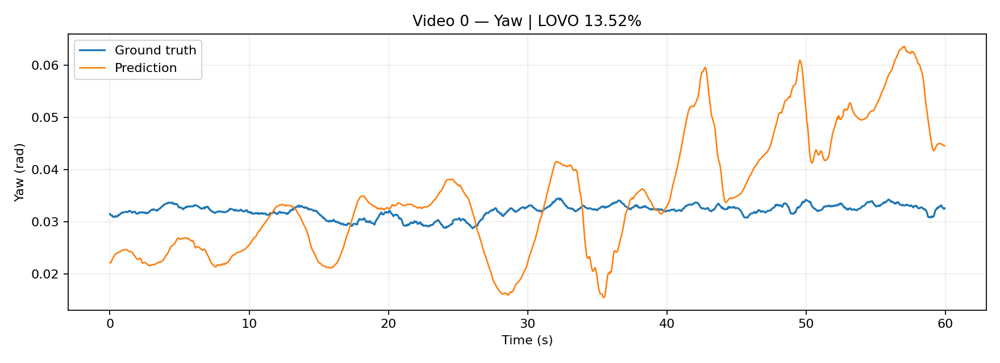

---

## Additional Prediction Plots

The repository contains pitch and yaw prediction visualizations for all five labeled driving sequences.

### Video 1

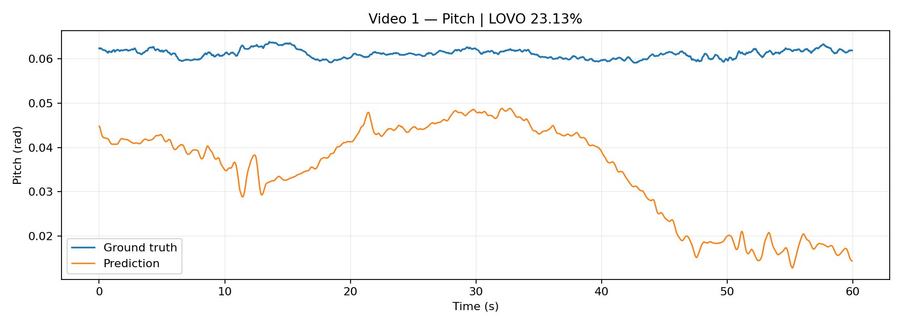

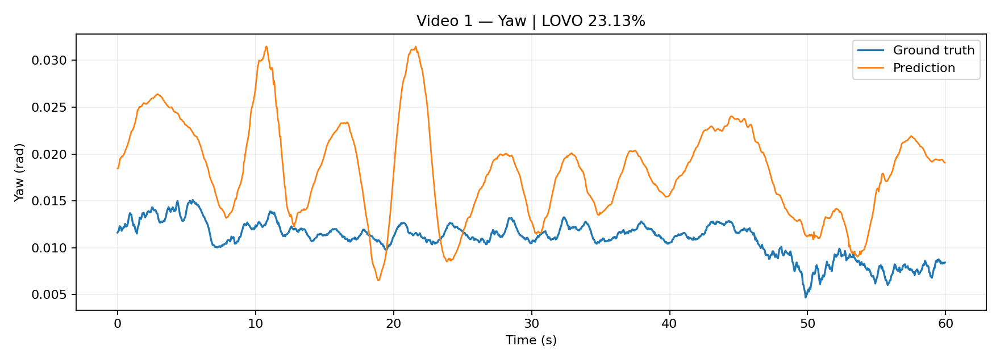

### Video 2

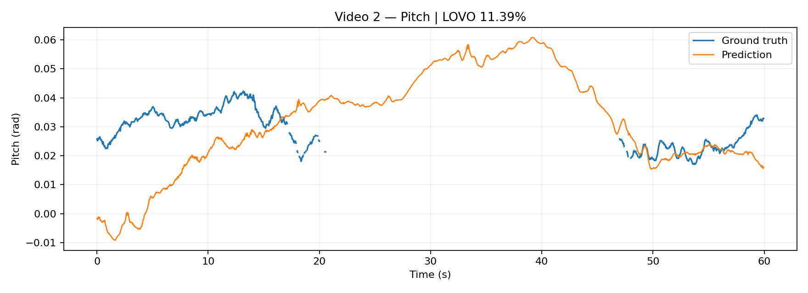

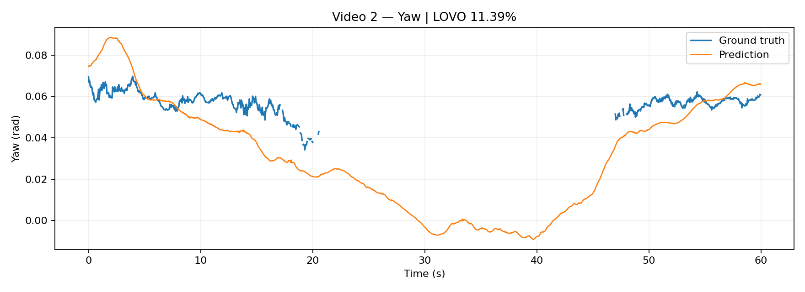

### Video 3

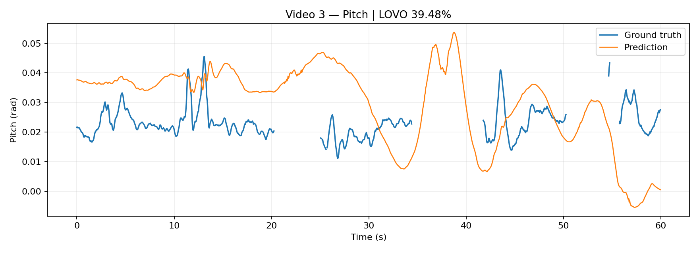

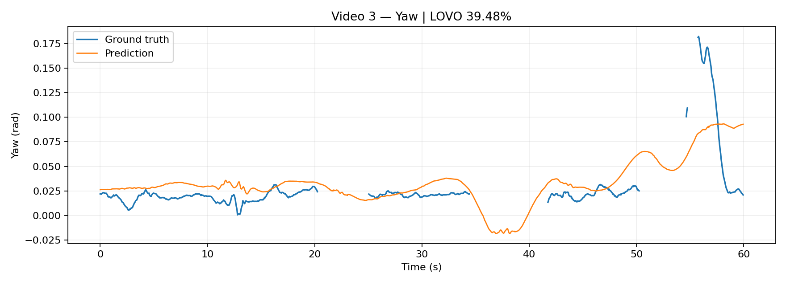

### Video 4

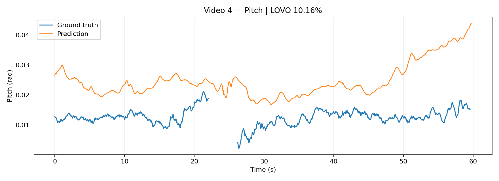

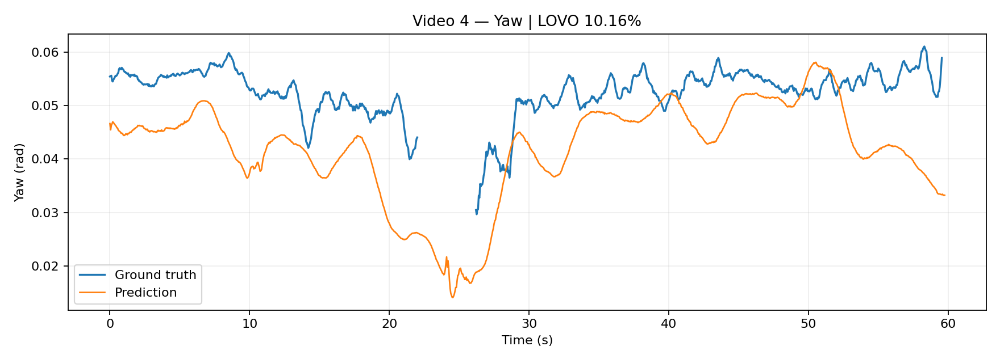

---

## Sample Dashcam Frames

These are example frames from the labeled driving sequences used during development and evaluation.

### Video 0

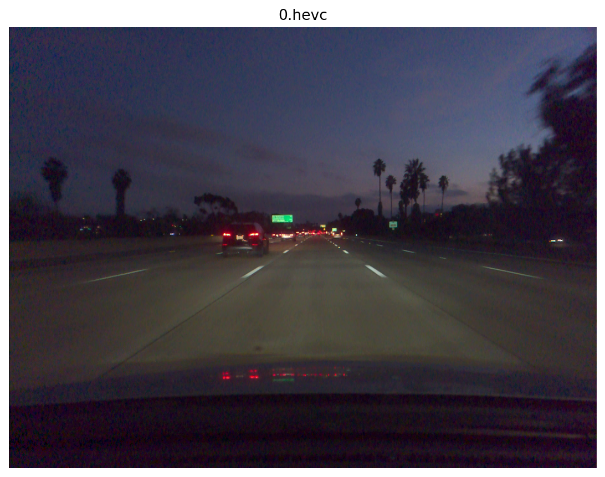

### Video 1

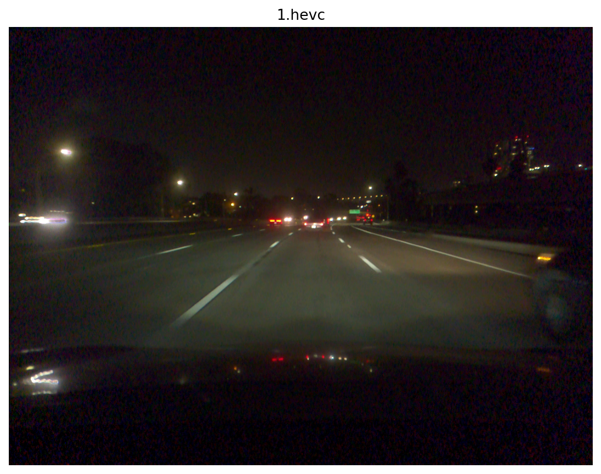

### Video 2

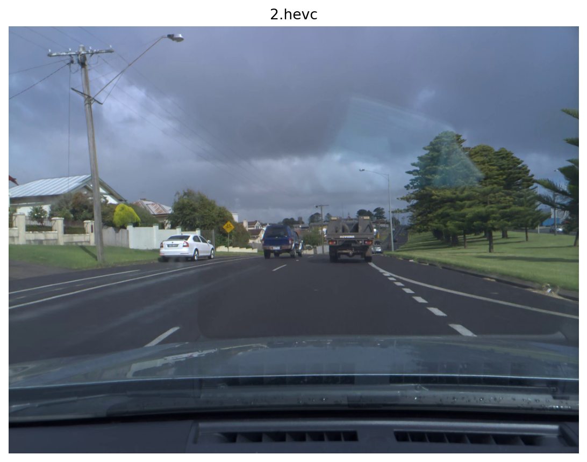

### Video 3

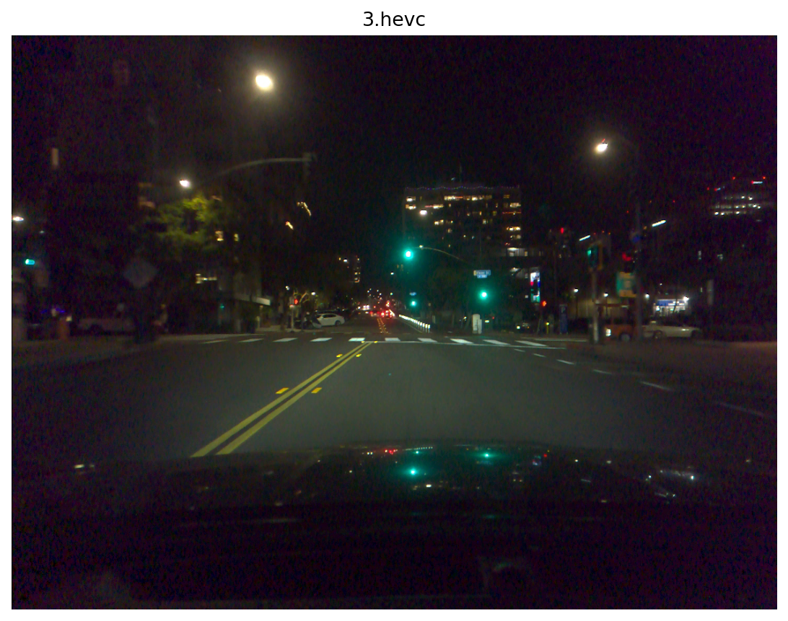

### Video 4

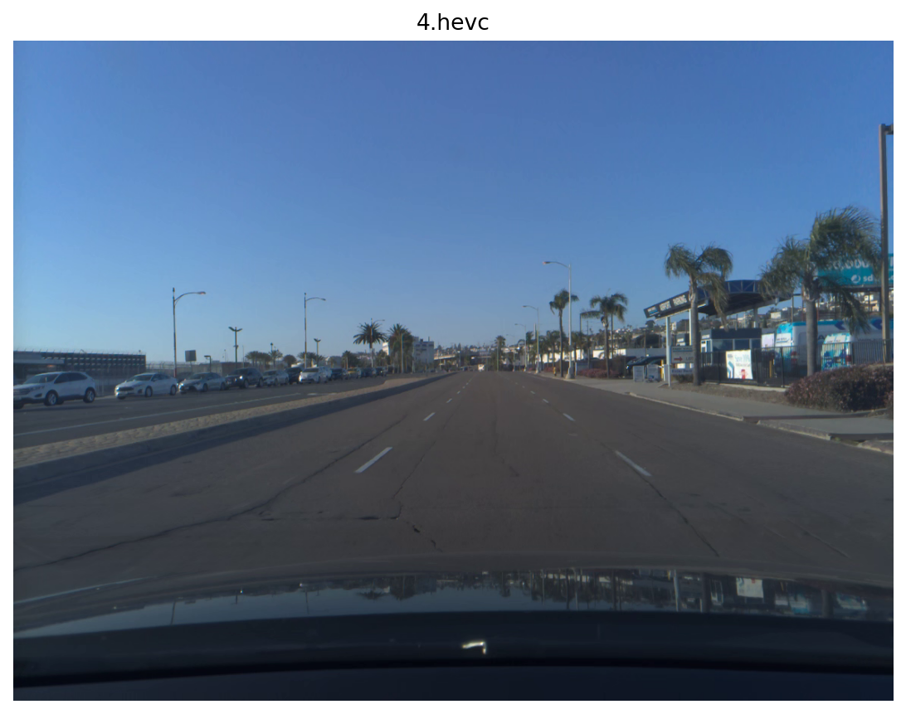

---

## Project Structure

```text
comma-ai-calibration-challenge/
│
├── comma_calibration_GITHUB_COMPLETE/
│   │
│   ├── src/
│   │   ├── motion_features.py
│   │   ├── model.py
│   │   ├── validate.py
│   │   ├── train_predict.py
│   │   └── make_results.py
│   │
│   ├── results/
│   │   ├── frames/
│   │   │   ├── video_0_sample.png
│   │   │   ├── video_1_sample.png
│   │   │   ├── video_2_sample.png
│   │   │   ├── video_3_sample.png
│   │   │   └── video_4_sample.png
│   │   │
│   │   ├── plots/
│   │   │   ├── validation_scores.png
│   │   │   ├── video_0_pitch.png
│   │   │   ├── video_0_yaw.png
│   │   │   ├── video_1_pitch.png
│   │   │   ├── video_1_yaw.png
│   │   │   ├── video_2_pitch.png
│   │   │   ├── video_2_yaw.png
│   │   │   ├── video_3_pitch.png
│   │   │   ├── video_3_yaw.png
│   │   │   ├── video_4_pitch.png
│   │   │   └── video_4_yaw.png
│   │   │
│   │   ├── validation_scores.csv
│   │   └── summary.txt
│   │
│   ├── submission/
│   │   ├── 5.txt
│   │   ├── 6.txt
│   │   ├── 7.txt
│   │   ├── 8.txt
│   │   └── 9.txt
│   │
│   ├── requirements.txt
│   ├── LICENSE
│   └── README.md
│
└── README.md
```

---

## Running the Project

### 1. Clone the repository

```bash
git clone https://github.com/Rashmioffcialpage/comma-ai-calibration-challenge.git
cd comma-ai-calibration-challenge/comma_calibration_GITHUB_COMPLETE
```

### 2. Create a virtual environment

```bash
python3 -m venv .venv
source .venv/bin/activate
```

### 3. Install dependencies

```bash
pip install -r requirements.txt
```

### 4. Add challenge data

Create a local directory called:

```text
data/
```

Place the challenge files inside it:

```text
data/
├── 0.hevc
├── 0.txt
├── 1.hevc
├── 1.txt
├── 2.hevc
├── 2.txt
├── 3.hevc
├── 3.txt
├── 4.hevc
├── 4.txt
├── 5.hevc
├── 6.hevc
├── 7.hevc
├── 8.hevc
└── 9.hevc
```

The raw challenge videos are intentionally not included in this repository.

---

## Generate Motion Features

Run:

```bash
python src/motion_features.py \
data/0.hevc \
data/1.hevc \
data/2.hevc \
data/3.hevc \
data/4.hevc \
data/5.hevc \
data/6.hevc \
data/7.hevc \
data/8.hevc \
data/9.hevc
```

This creates feature files for each video.

---

## Run Validation

```bash
python src/validate.py --data data
```

Example local output:

```text
video 0: 12.07%
video 1: 24.98%
video 2: 10.31%
video 3: 36.36%
video 4: 10.02%
aggregate: 17.84%
```

---

## Generate Result Visualizations

```bash
python src/make_results.py --data data --out results
```

This generates:

* validation score chart
* pitch prediction plots
* yaw prediction plots
* sample dashcam frames
* validation CSV
* summary file

---

## Generate Final Predictions

Run:

```bash
python src/train_predict.py --data data --out submission
```

The final prediction files are:

```text
submission/5.txt
submission/6.txt
submission/7.txt
submission/8.txt
submission/9.txt
```

Each file contains **1,200 rows**, corresponding to the frames in each one-minute 20 FPS challenge video.

---

## Methodology

### Optical Flow

Visual features are detected and tracked between consecutive frames to estimate apparent scene motion.

### Focus of Expansion

The tracked motion vectors are used to estimate a focus of expansion, providing information about the direction of camera translation.

### Geometric Features

The estimated motion geometry is transformed into features related to the camera-frame pitch and yaw direction.

### Temporal Features

Motion information across multiple frames is incorporated to reduce frame-to-frame noise and improve stability.

### Regression Calibration

Regression models are trained on the provided labeled driving sequences to map the extracted motion features to pitch and yaw predictions.

### Cross-Video Validation

Leave-one-video-out validation is used so that each evaluation sequence is excluded from training.

This provides a more realistic estimate of how well the approach generalizes to unseen driving sequences.

---

## What I Learned

This project helped me explore computer vision and autonomous-driving problems from a systems perspective, including:

* Optical-flow based motion estimation
* Camera geometry
* Focus-of-expansion estimation
* Temporal feature engineering
* Robust regression
* Autonomous-driving perception
* Cross-sequence evaluation
* Failure analysis
* Reproducible experimentation

One of the main lessons was the value of starting with an interpretable geometric baseline before moving toward more complex machine-learning approaches, especially when working with a small dataset.

The project also reinforced the importance of evaluating across complete driving sequences rather than relying only on training-set performance.

---

## Future Improvements

Potential improvements include:

* Essential-matrix-based ego-motion estimation
* Better road-region filtering
* Dynamic-object filtering
* More robust focus-of-expansion estimation
* Improved temporal modeling
* Camera-motion confidence estimation
* Learned visual representations
* Real-time runtime optimization
* Combining geometric and neural approaches
* Testing the approach directly within openpilot simulation infrastructure

---

## Submission

The generated challenge predictions are available in:

```text
comma_calibration_GITHUB_COMPLETE/submission/
```

The folder contains:

```text
5.txt
6.txt
7.txt
8.txt
9.txt
```

These correspond to the five unlabeled comma.ai challenge videos.

---

## Challenge

This project was built for the comma.ai Calibration Challenge and is an independent technical exploration of motion estimation and camera calibration for autonomous-driving systems.

Challenge information:

https://comma.ai/leaderboard

---

## Author

**Rashmi Thimmaraju**

M.S. Artificial Intelligence — Long Island University

GitHub: https://github.com/Rashmioffcialpage

LinkedIn: https://www.linkedin.com/in/rashmi71269

Portfolio: https://rashmi-portfolio-iota.vercel.app/
